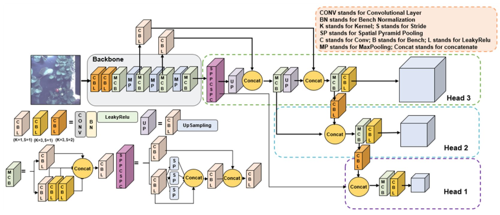
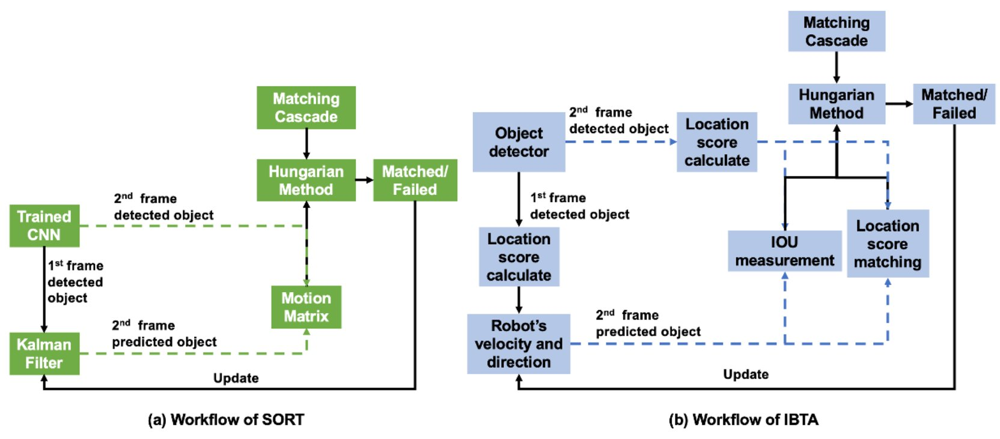
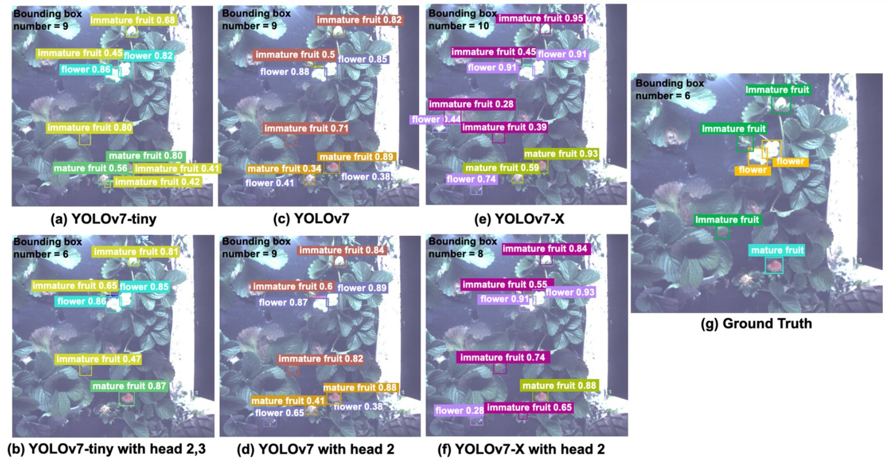

# Strawberry Detection and Counting based on YOLOv7 Pruning and Information Based Tracking Algorithm (IBTA)

> **Paper:** [arXiv:2407.12614](https://arxiv.org/abs/2407.12614)

A complete pipeline for **multi-object tracking of strawberry fruits and flowers** (flower, immature fruit, mature fruit) from a mobile robot platform. The system covers three stages: detection training with head pruning, tracking with robot-motion compensation, and MOT evaluation.

---

## Pipeline Overview

```
detection/          →         tracking/          →        evaluation/
YOLOv7 (head pruning)    IBTA / Step-SORT              py-motmetrics
   ↓                           ↓                              ↑
det.txt per frame      output/*.txt (with IDs)     MOTA / MOTP / IDF1 ...
```

---

## Network Architecture

The detector is based on YOLOv7 with a three-scale detection head (Head 1 / 2 / 3). A key contribution is **detection head pruning**: each head is trained independently and in combination to find the optimal subset for strawberry detection.



---

## Tracking Algorithm (IBTA)

IBTA (Information Based Tracking Algorithm) replaces the Kalman filter in standard SORT with robot velocity/direction information and adds a location-score matching cascade for dense, overlapping fruits.



**(a)** Standard SORT uses a Kalman filter to predict object positions.  
**(b)** IBTA uses the robot's velocity and direction to predict positions, then matches via IoU measurement and location-score matching in a two-stage cascade.

---

## Detection Results

Comparison of different YOLOv7 model variants and head configurations on strawberry detection:



Head pruning (e.g. YOLOv7-tiny with head 2,3) achieves comparable bounding box counts to the full model while reducing false positives, particularly for small overlapping objects.

---

## Key Results

### Detection — Head Ablation (mAP@0.5)

| Model | Heads | mAP@0.5 (%)|
|-------|-------|---------|
| YOLOv7-tiny | All (1+2+3) | 87.6 |
| YOLOv7-tiny | Head 2+3 | **89.1** |
| YOLOv7 | All | 78.1 |
| YOLOv7 | Head 2 | **89.0** |
| YOLOv7-X | Head 2 | 87.4 |

### Tracking — MOT Metrics (Flower, sequence 4)

| Method | MOTA ↑ | MOTP ↑ | IDF1 ↑ | IDs ↓ |
|--------|--------|--------|--------|-------|
| [CTA (Puranik et al., 2021)](https://doi.org/10.3920/978-90-8686-916-9_15) | 76.7 | 81.8 | 75.8 | 46 |
| **IBTA (ours)** | **89.0** | **87.8** | **88.2** | **34** |


---

## Repository Structure

```
fruit-tracking/
├── docs/images/             ← figures used in this README
│   ├── fig_arch.png         #   network architecture diagram
│   ├── fig_ibta.png         #   IBTA vs SORT workflow
│   └── fig_detection.png    #   detection result comparison
│
├── detection/               # YOLOv7-based fruit detector
│   ├── cfg/training/        # Model configs (full / per-head ablation)
│   ├── models/              # YOLOv7 model definitions
│   ├── utils/               # Training utilities
│   ├── data/SLdata.yaml     # Dataset config (3 classes)
│   ├── detect.py            # Run inference
│   ├── trainyolov7.py       # Train full model
│   ├── trainyolov7h[1-3].py # Train single-head variants
│   ├── trainyolov7h[12|13|23].py  # Train dual-head variants
│   └── run.py               # Run all ablation trainings sequentially
│
├── tracking/                # IBTA tracker
│   ├── sortwithstep.py      # Step-compensated SORT (Kalman + robot motion)
│   ├── Vsort.py             # Location-score assisted tracker (IBTA core)
│   ├── stepcal.py           # Compute step value from GT annotations
│   ├── ioucal.py            # Standalone IoU utility
│   ├── dataTransform.py     # Format conversion utilities
│   ├── data000/             # Example detection input (MOT format)
│   ├── gt_data/             # Ground-truth annotations (per category)
│   │   ├── flowerGT/
│   │   ├── immaturefruitGT/
│   │   └── maturefruitGT/
│   └── output/              # Tracking results (generated)
│
└── evaluation/              # MOT metrics evaluation
    ├── motmetrics/          # Modified py-motmetrics library
    │   └── apps/
    │       └── eval_motchallenge.py   # Main evaluation script
    └── yourdata/            # Example GT + tracker result pairs
```

---

## Modules

### 1. Detection — `detection/`

YOLOv7 fine-tuned for three strawberry classes: **flower**, **immature fruit**, **mature fruit**.

The detection head is decomposed into three scale-specific sub-heads (Head 1: small objects, Head 2: medium, Head 3: large). Seven training configurations enable systematic ablation to find the optimal head subset per object category.

**Quick start:**
```bash
cd detection

# Train full model
python trainyolov7.py --cfg cfg/training/yolov7/yolov7.yaml \
                      --data data/SLdata.yaml \
                      --weights '' --epochs 150

# Train head-2-only variant
python trainyolov7h2.py

# Run inference (saves det.txt for tracker input)
python detect.py --weights runs/train/exp/weights/best.pt \
                 --source path/to/video.mp4 --save-txt

# Run all ablation experiments sequentially
python run.py
```

---

### 2. Tracking — `tracking/`

IBTA removes the Kalman filter and replaces it with explicit robot motion compensation, then adds a two-stage matching cascade (IoU + location score).

#### Step 1 — Compute the step value from your data
```bash
python stepcal.py --input gt_data/flowerGT/4.txt
# Output: Average step: 314.57 pixels/frame
```

#### Step 2 — Run the tracker
```bash
# Step-compensated SORT
python sortwithstep.py --seq_path data000 --step 314.57 --max_age 2 --min_hits 0

# IBTA (location-score assisted)
python Vsort.py --input gt_data/flowerGT/4.txt \
                --output stepmatchoutput/flower4.txt \
                --step 315
```

#### Step 3 — Convert formats
```bash
# GT → evaluation format
python dataTransform.py --mode gt2eval \
    --input gt_data/flowerGT/4.txt --output Fgt4.txt

# SORT result → DarkLabel visualisation
python dataTransform.py --mode sort2darklabel \
    --input output/flower4.txt --output flower4_vis.txt --label "mature fruit"
```

#### Tracking input format (MOT15-2D)
Detection files under `data000/train/<sequence>/det/det.txt`:
```
frame, -1, x, y, w, h, score, -1, -1, -1
```

#### Tracking output format
```
frame, id, x, y, w, h, 1, -1, -1, -1
```

---

### 3. Evaluation — `evaluation/`

Modified [py-motmetrics](https://github.com/cheind/py-motmetrics) for computing standard MOT metrics.

**Key modifications from the original library:**
- Data paths are relative and configurable via `--groundtruths` / `--tests` (default: `yourdata/`)
- `min_confidence=-1` accepts all tracks regardless of confidence score
- Matching uses **Euclidean centre-point distance** (threshold: 5000 px) instead of IoU, which works better for dense/overlapping strawberries

**Organize your data:**
```
evaluation/yourdata/
├── video1/gt/gt.txt     # ground truth
├── video2/gt/gt.txt
├── video1.txt           # tracker result
└── video2.txt
```

Each file uses MOT15-2D format:
```
frame, id, x, y, w, h, confidence, -1, -1, -1
```
Set `confidence=-1` if your tracker does not output a score.

**Run evaluation:**
```bash
cd evaluation
python motmetrics/apps/eval_motchallenge.py
# or with custom paths:
python motmetrics/apps/eval_motchallenge.py \
    --groundtruths yourdata --tests yourdata
```

**Output metrics:** MOTA, MOTP, IDF1, MT, ML, FP, FN, IDs, FM, and more.

---

## Installation

### Detection
```bash
cd detection
pip install -r requirements.txt
```

### Tracking
```bash
cd tracking
pip install -r requirements.txt
# filterpy==1.4.5  scikit-image==0.17.2  lap==0.4.0
```

### Evaluation
```bash
cd evaluation
pip install -r requirements.txt
```

---

## Dataset

Ground-truth annotations in `tracking/gt_data/` cover three strawberry categories across 44 video sequences captured by a mobile agricultural robot. File naming convention: `<date>_<id>_<camera>.txt` (field recordings) or `<number>.txt` (lab sequences).

GT file format:
```
frame, id, x, y, w, h, 1, -1, -1, -1
```

---

## Citation

If you use this code or find our work helpful, please cite:

```bibtex
@article{liu2024strawberry,
  title={Strawberry detection and counting based on YOLOv7 pruning and information based tracking algorithm},
  author={Liu, Shiyu and Zhou, Congliang and Lee, Won Suk},
  journal={arXiv preprint arXiv:2407.12614},
  year={2024}
}
```

> **Note:** Please fill in the `author` field with the full author list from the paper.

This work also builds on:

```bibtex
@inproceedings{Bewley2016_sort,
  author    = {Bewley, Alex and Ge, Zongyuan and Ott, Lionel and Ramos, Fabio and Upcroft, Ben},
  booktitle = {2016 IEEE International Conference on Image Processing (ICIP)},
  title     = {Simple online and realtime tracking},
  year      = {2016},
  pages     = {3464--3468},
  doi       = {10.1109/ICIP.2016.7533003}
}

@inproceedings{wang2023yolov7,
  title     = {YOLOv7: Trainable bag-of-freebies sets new state-of-the-art for real-time object detectors},
  author    = {Wang, Chien-Yao and Bochkovskiy, Alexey and Liao, Hong-Yuan Mark},
  booktitle = {CVPR},
  year      = {2023}
}
```

---

## License

- Tracking code (`tracking/sortwithstep.py`): GPL-3.0 (inherited from SORT)
- Evaluation code (`evaluation/`): MIT (inherited from py-motmetrics)
- Detection code (`detection/`): GPL-3.0 (inherited from YOLOv7)
